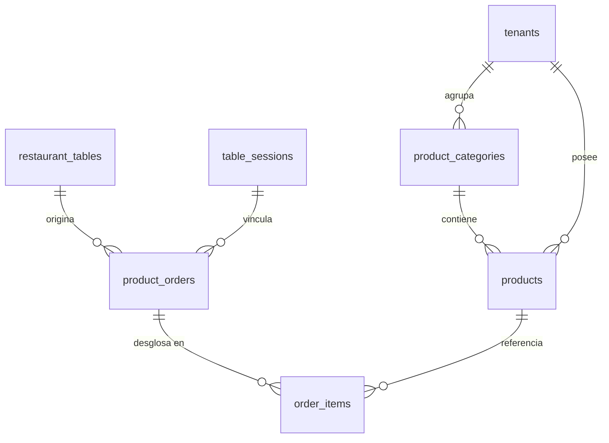

# Especificación de Diseño: Catálogo de Productos, Control de Stock y Pedidos en Tiempo Real

**Fecha:** 2026-09-25  
**Estado:** Aprobado para Planificación  
**Arquitectura:** Local-First / Offline-First (Dexie.js + Fastify + PostgreSQL/Drizzle)

---

## 1. Resumen Ejecutivo y Objetivos

El objetivo de este módulo es dotar a BarFlow de un sistema de catálogo de productos (sin imágenes en esta fase para optimizar almacenamiento), control reactivo de existencias (stock), menú interactivo para clientes con búsqueda y categorías, ranking dinámico de favoritos ("Los más pedidos") y un flujo de pedidos en tiempo real que se integra en la cola de atención del personal con semáforo de urgencia, preservando el contacto humano entre el mesero y el comensal.

### Principios Rectores:
1. **Local-First & Cero Latencia:** El menú del cliente y el catálogo del administrador operan sobre IndexedDB (Dexie) mediante `useLiveQuery`.
2. **Contacto Humano Preservado:** El cliente solicita el producto desde su celular (vía QR de mesa), pero el mesero valida y confirma el pedido físicamente en la mesa antes de descontar stock.
3. **Control Estricto de Stock:** Productos con stock $0$ se bloquean en el menú. La confirmación en mesa descuenta existencias de forma atómica y notifica en tiempo real a todos los clientes.
4. **Ranking Dinámico de Favoritos:** Cálculo automático por volumen de unidades pedidas (`total_orders`), con interruptor general administrable por el gestor.
5. **Cola Unificada de Servicio:** Los pedidos se suman al feed de llamados con orden FIFO y la misma función matemática de urgencia continua (HSL).

---

## 2. Modelo de Datos y Esquema Relacional

### A. Frontend (Dexie.js / IndexedDB) y Backend (Drizzle ORM / PostgreSQL)

Todos los identificadores se gestionan como `varchar(100)` para máxima interoperabilidad y compatibilidad con IDs generados en el cliente (`crypto.randomUUID()`).

#### 1. Tabla `product_categories`
Agrupa productos en el menú interactivo.
* `id: varchar(100)` — Clave primaria.
* `tenantId: varchar(50)` — Aislamiento multi-tenant (por defecto `'default'`).
* `name: varchar(100)` — Nombre legible (ej. "Cervezas", "Cocteles de Autor", "Para Picar").
* `sortOrder: integer` — Orden relativo para las pestañas del menú.
* `createdAt: bigint` — Marca de tiempo UNIX (milisegundos).

#### 2. Tabla `products`
Catálogo de productos y control de inventario.
* `id: varchar(100)` — Clave primaria.
* `tenantId: varchar(50)` — Aislamiento multi-tenant.
* `categoryId: varchar(100)` — Referencia a `product_categories.id` (`ON DELETE CASCADE`).
* `name: varchar(100)` — Nombre del producto.
* `description: text` — Descripción de ingredientes o notas (opcional).
* `price: integer` — Precio unitario de venta (número entero en moneda local).
* `stock: integer` — Unidades físicas disponibles.
* `isActive: boolean` — Interruptor para habilitar/deshabilitar en el menú.
* `totalOrders: integer` — Acumulador incremental de unidades vendidas para el ranking dinámico.
* `updatedAt: bigint` — Marca de tiempo de la última mutación.

#### 3. Tabla `product_orders`
Comandas generadas por los clientes en las mesas.
* `id: varchar(100)` — Clave primaria.
* `tenantId: varchar(50)` — Aislamiento multi-tenant.
* `tableId: varchar(100)` — Referencia a `restaurant_tables.id`.
* `sessionId: varchar(100)` — Referencia a `table_sessions.id`.
* `tableName: varchar(50)` — Snapshot del nombre de la mesa al momento del pedido.
* `sessionWord: varchar(50)` — Snapshot de la palabra clave de sesión.
* `status: varchar(20)` — Estados: `'pending'` | `'confirmed'` | `'rejected'` | `'delivered'`.
* `totalAmount: integer` — Suma total del pedido en moneda local.
* `createdAt: bigint` — Timestamp de creación (base del cálculo de urgencia FIFO).
* `confirmedAt: bigint` — Timestamp de validación física por el mesero (opcional).

#### 4. Tabla `order_items`
Detalle de líneas de producto asociadas a cada pedido.
* `id: varchar(100)` — Clave primaria.
* `orderId: varchar(100)` — Referencia a `product_orders.id` (`ON DELETE CASCADE`).
* `productId: varchar(100)` — Referencia a `products.id` (`ON DELETE RESTRICT`).
* `productName: varchar(100)` — Snapshot histórico del nombre.
* `unitPrice: integer` — Snapshot histórico del precio al ordenar.
* `quantity: integer` — Cantidad solicitada.
* `notes: text` — Notas específicas del cliente (ej. "sin hielo", "bien frío").

#### 5. Configuración de Establecimiento (`app_settings`)
* Clave: `show_favorites_ranking` (booleano, por defecto `true`). Almacenado en la configuración del tenant en Dexie y PostgreSQL.

---

## 3. Arquitectura del Flujo y Componentes de Usuario

### A. Experiencia del Cliente (`CustomerPortal`)

1. **Estructura Modular:**
   * `CustomerMenu`: Componente principal del menú, suscrito a Dexie con `useLiveQuery`.
   * `ProductSearchBar`: Búsqueda instantánea en vivo por texto en `name` y `description`.
   * `CategoryFilterTabs`: Pestañas horizontales ("Todas", y categorías ordenadas por `sortOrder`).
   * `FavoritesSection`: Carrusel superior con los productos que tienen mayor `totalOrders` (visible solo si `show_favorites_ranking === true`).
   * `ProductCard`:
     * Muestra nombre, descripción, precio y badge de stock.
     * Si `stock === 0`: Se marca visualmente como *"Agotado"* y se deshabilitan los botones.
     * Si `stock <= 3`: Se muestra aviso amigable *"Últimas X unidades"*.
     * Selector de cantidad `[-] 1 [+]` respetando el límite de `stock`.
   * `OrderCartDrawer`: Bottom sheet que aparece cuando hay productos seleccionados. Permite revisar el pedido, agregar notas por producto y pulsar **"Enviar Pedido a Mesa"**.
2. **Ciclo de Vida en el Cliente:**
   * Al pulsar enviar, se inserta en Dexie con `status = 'pending'`, se emite `ORDER_CREATED` por WebSocket al canal `staff` y se muestra un banner: *"Pedido enviado a tu mesa. El mesero se acercará a confirmar."*
   * Mientras esté `'pending'`, el cliente tiene la opción de **"Cancelar pedido"**.

---

### B. Atención y Validación por el Personal (`StaffDashboard`)

1. **Cola Unificada de Atención (`UnifiedAttentionFeed`):**
   * Convive en el panel superior junto a los llamados tradicionales de mesero.
   * Cada tarjeta de pedido muestra:
     * Badge distintivo *"📦 Pedido"*.
     * Nombre de la mesa y total de ítems.
     * Semáforo de urgencia continuo calculado mediante `calculateUrgency(createdAt)` en espacio de color HSL.
2. **Modal de Confirmación del Mesero:**
   * El mesero toca el pedido para abrir el detalle:
     * Lista de ítems, cantidades, notas y total.
   * **Acción: "Confirmar Pedido":**
     * Valida existencias locales en tiempo real (`stock >= quantity`).
     * En una transacción atómica de Dexie:
       1. Descuenta `stock` en `products`.
       2. Incrementa `totalOrders` en `products`.
       3. Marca el pedido como `'confirmed'` con `confirmedAt = Date.now()`.
     * Emite `ORDER_CONFIRMED` y `STOCK_UPDATED` vía WebSocket.
     * Encola evento en `sync_queue` para sincronización con el servidor.
   * **Acción: "Rechazar Pedido":**
     * Marca el pedido como `'rejected'`. No altera stock. Notifica al cliente.

---

### C. Gestión del Administrador (`MenuManagementTab`)

* Nueva pestaña en la barra de navegación protegida por RBAC (`role === 'manager'`).
* **Funcionalidades:**
  * Interruptor general: *"Mostrar ranking de favoritos en menú de clientes"*.
  * Creación y edición de categorías.
  * Creación y edición de productos (nombre, descripción, precio, stock, activo/inactivo).
  * **Ajuste Rápido de Stock:** Botones directos `[-] [Stock actual] [+]` en cada fila del producto para reposición ágil durante el servicio.
  * Métrica del ranking de ventas con botón para reiniciar contadores de temporada.

---

## 4. Sincronización Outbox y WebSockets en Tiempo Real

### Eventos de Outbox (`sync_queue`):
* `CATEGORY_CREATED`, `CATEGORY_UPDATED`, `CATEGORY_DELETED`
* `PRODUCT_CREATED`, `PRODUCT_UPDATED`, `PRODUCT_DELETED`
* `PRODUCT_STOCK_UPDATED`
* `ORDER_CREATED`, `ORDER_CONFIRMED`, `ORDER_REJECTED`

### Ingesta en Backend (`SyncOutboxBatchUseCase.ts`):
* Idempotencia estricta mediante `sync_audit_log` con `clientEventId`.
* Si un lote se reenvía por problemas de conexión, se ignoran duplicados sin duplicar descuentos de stock.

### Eventos de WebSocket:
* `ORDER_CREATED`: Notifica a `staff` con alerta sonora.
* `ORDER_CONFIRMED` / `ORDER_REJECTED`: Notifica al cliente en `table:<id>` y al personal.
* `STOCK_UPDATED`: Retransmite a todos los clientes para mantener los menús sincronizados al instante.

---

## 5. Manejo de Errores y Concurrencia

1. **Concurrencia en Última Unidad:** Si dos mesas solicitan la última cerveza casi simultáneamente, ambas órdenes entran en `'pending'`. Cuando el mesero confirma la primera, el stock baja a $0$. Al intentar confirmar la segunda, el sistema notifica al mesero: *"Stock insuficiente (0 disponibles)"*, permitiendo cancelar o sustituir el ítem en mesa con el cliente.
2. **Resiliencia Offline:** Toda la navegación, catálogo y creación de pedidos funciona sin internet en la red local. Al restablecer la conexión, el outbox evacúa los eventos de forma ordenada.

---

## 6. Estrategia de Verificación y Pruebas

* **Pruebas Unitarias Frontend (Vitest):**
  * Ordenamiento del ranking de favoritos y respeto del toggle de configuración.
  * Filtrado de productos por categoría y búsqueda textual.
  * Bloqueo de productos agotados y validación de cantidades en el carrito.
  * Reducción atómica de stock en la confirmación del mesero.
* **Pruebas Unitarias Backend (Vitest):**
  * Ingesta de pedidos y categorías en `SyncOutboxBatchUseCase`.
  * Idempotencia de stock y rechazo de duplicados vía `sync_audit_log`.
* **Verificación de Compilación:**
  * Frontend: `npm run test` y `npm run build` (`tsc -b && vite build`) con 0 errores.
  * Backend: `npm run test` y `npm run build` (`tsc`) con 0 errores.
* **Regla de Tamaño de Archivo (AGENTS.md):**
  * Ningún archivo superará las 300 líneas de código.
